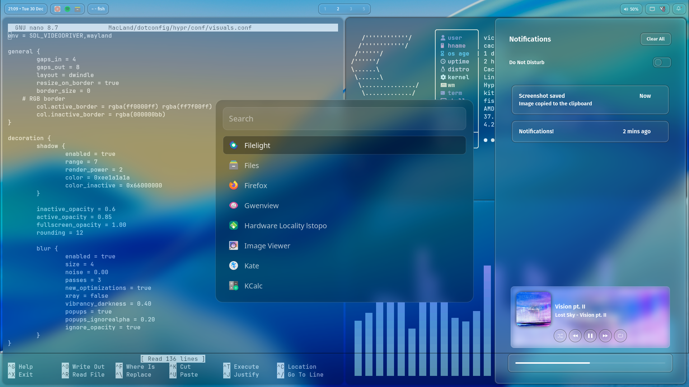
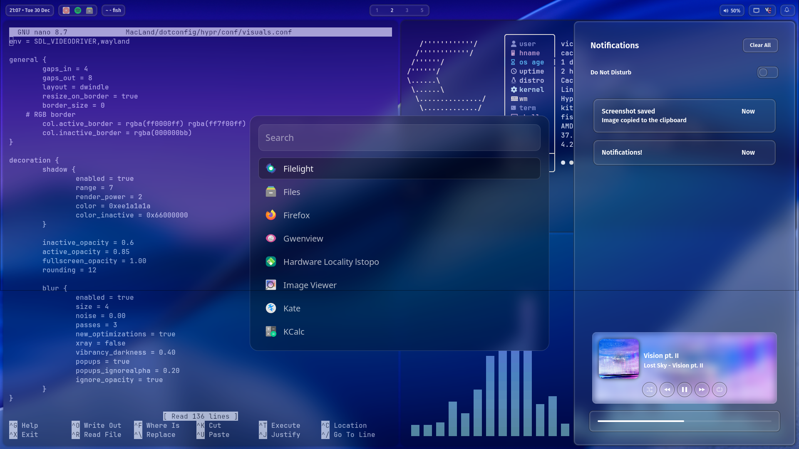

# MacLand — Hyprland Dotfiles (Arch Linux)

A **glassy-style Hyprland setup** for Arch-based systems.  
Inspired by macOS aesthetics, but **not intended to replicate macOS**.

> Screenshots were taken on **CachyOS**.

---

## 🖼️ Screenshots

### Light Mode


### Dark Mode


---

## 🧩 Setup Overview

- **OS:** Arch Linux / Arch-based distros  
- **WM:** Hyprland  
- **Bar:** Waybar  
- **Launcher:** Rofi  
- **Terminal:** Kitty  
- **Notifications:** SwayNC  
- **Lockscreen:** Hyprlock  
- **Idle Daemon:** Hypridle  
- **Wallpaper:** Hyprpaper / Waypaper  
- **File Manager:** Nautilus  
- **Shell Prompt:** Oh My Posh  
- **Fonts:** JetBrains Mono Nerd Font, Fira Sans, Noto Fonts  
- **Theme Style:** Glassmorphism / blur-heavy UI  

---

## ⚙️ Requirements

- Arch Linux or Arch-based distro
- **Fresh minimal install strongly recommended**
- Working internet connection
- Hyprland-compatible GPU & drivers
- `git` installed
- Basic Arch/Linux knowledge

---

## 🚀 Installation

⚠️ **WARNING:**  
This script will **overwrite existing configs** in `~/.config` and `$HOME`.  
Back up your dotfiles before proceeding.

```bash
git clone https://github.com/thepixel3261/MacLand.git ~/dotfiles
cd ~/dotfiles
chmod +x install.sh
./install.sh
```

During installation you will be prompted for:
- Confirmation before overwriting configs
- Optional “sun” app bundle (extra apps / possible bloat)
- Optional SDDM theme installation
- Optional NVIDIA driver installation
- Keyboard layout selection

A reboot is recommended after installation.

---

## 🔄 Updating

To update and re-apply the dotfiles:

```bash
cd ~/dotfiles
chmod +x update.sh
./update.sh
```

---

## 📦 Packages Installed

### Core (Pacman)
- hyprland, hyprlock, hypridle, hyprpaper
- waybar, swaync, rofi, kitty
- sddm, polkit-gnome
- fastfetch, cava, hyprshot
- network-manager-applet, blueman, pavucontrol
- nautilus, loupe, celluloid
- fonts, icons, portals, utilities

### AUR
- waypaper
- zen-browser-bin
- oh-my-posh
- nerd-fonts-complete-mono-glyphs

### Optional (“sun” bundle)
Includes apps like:
- Spotify, Vesktop, OBS
- Developer tooling (Go, Rust, Java, .NET)
- Office software, database tools
- Extra fonts and proprietary apps

---

## 🖥️ NVIDIA Notes

If selected, the installer:
- Installs NVIDIA drivers
- Disables nouveau
- Adds suspend/resume fixes for Hyprland
- Rebuilds initramfs

⚠️ **Do NOT install NVIDIA drivers** if your distro (e.g. CachyOS) already manages them.

---

## 🧠 Hyprland Version Handling

- Uses **new config layout** for Hyprland ≥ 0.53.0
- Falls back automatically for older versions
- No manual changes required

---

## ⚠️ Notes & Disclaimer

- This setup is **opinionated**
- Designed primarily for personal use
- Not guaranteed to work on heavily customized systems
- Expect to tweak things for your hardware and preferences

---

## 🧊 Credits & Inspiration

- Hyprland community
- Arch Linux ecosystem
- Glass-style UI concepts from various Unix setups

---

## 📜 License

Use, fork, modify, and share freely.
